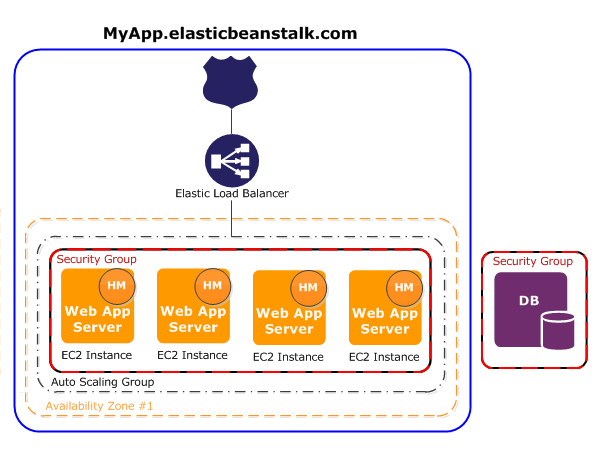
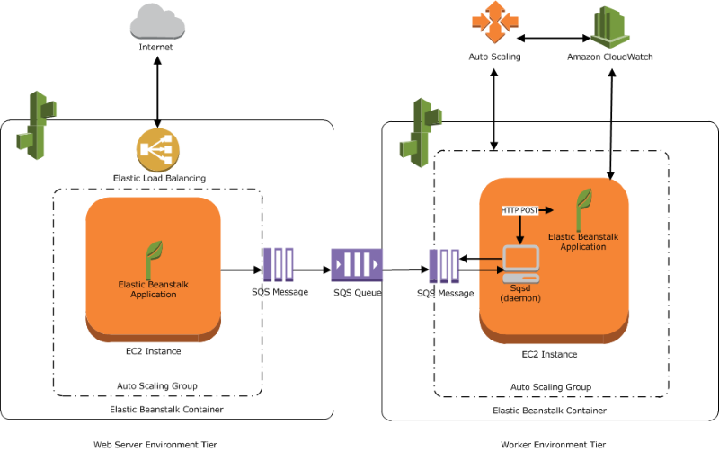
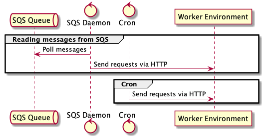

<!-- _backgroundColor: #1a1a1a -->
<!-- _color: white -->

# Running Spring Boot apps in AWS Elastic Beanstalk

Aleksandr Barmin
March 2022

---

<!-- _backgroundColor: #1a1a1a -->
<!-- _color: white -->

# Aleksandr Barmin

- Chief Software Engineer I
- AWS Solution Architect Associate
- AWS Developer Associate

Aleksandr_Barmin@epam.com

---

# Agenda

- Compute options in AWS
- Not so deep dive into EC2
- Use cases for VMs
- AWS Elastic Beanstalk intro
- Demo part

---

# AWS Serverless

- AWS Lambda
- AWS Fargate
- AWS S3 & DynamoDB
- AWS Aurora Serverless

---

# Containers in AWS

- AWS Elastic Container Service
- AWS Elastic Kubernetes Service

---

# AWS Elastic Compute Cloud - EC2

Actually, this is just a virtual machine (VM).

---

# Use cases for virtual machines

- Lift and shift migration
- High-performance computing
- Running and development of apps for Apple ecosystem
- Machine learning and other compute-heavy workloads

---

<!-- header: EC2 Instance Types -->

# EC2 Instance Types

- General purpose
- Compute optimized
- Memory optimized
- Storage optimized
- Accelerated computing

---

# General purpose EC2 instances

**Platforms:** x86, Mac, Arm
**Use cases:**

- General workloads
- Low-latency interactive applications
- Small and medium databases
- Virtual desktops
- Business-critical apps

---

# Compute optimized EC2 instances

**Use cases:**

- Batch processing
- Media transcoding
- High-performance web services
- High-performance computing
- Scientific modelling
- Machine learning
- Other compute-intensive workloads

---

# Memory optimized EC2 instances

Designed to deliver high performance for workloads that process large data sets in memory.

**Use cases:**

- Open-source databases
- In-memory caches
- Real-time big data analytics

---

# Storage optimized

Designed for workloads that require high, sequential read and write access to very large data sets on local storage.

**Use cases:**

- Relational and non-relational database
- Search engines
- Data analytic workloads

---

# Accelerated computing

GPU-based computing.

**Use cases:**

- Machine learning
- Fluid dynamics
- Computational finance
- Seismic analysis
- Speech recognition
- Autonomous vehicles
- Drug discovery

---

# EC2 instance features

- Instances with burastable performance
- Different storage options
- Placement options

---

# Burstable Performance Instances

Bustable instances provide a baseline level of CPU performance with an ability to burst above baseline.

- Fixed performance - M6, C6, R6
- Burstable - T3

---

# EC2 Storage Options

EC2 instances are backed by EBS (elastic block storage) volumes.

EBS volume types:

- General purpose SSD
- Provisioned IOPS
- Magnetic

---

# Why don't we use EC2 everywhere?

- Need to manage infrastructure
- Need to manage hosts and install updates
- Complicated release process of app to avoid downtimes

---

# How does AWS Elastic Beanstalk help?

- No need to know underlying infrastructure
- Beanstalk is responsible for installing updates and performing releases
- Observability is out of the box
- Available via UI and CLI

---

<!-- header: AWS Elastic Beanstalk -->

# AWS Elastic Beanstalk

Easy-to-use service for deploying and scaling web applications and services developed with Java, .Net, PHP, Python, Ruby, Go and Docker.

You write the code, AWS Elastic Beanstalk will handle the deployment, from capacity provisioning to health monitoring.

---

# Beanstalk Concepts

- Application
- Application Version
- Environment
- Environment Tier
- Environment Configuration
- Saved Configuration
- Platform

---

# Web Environment

Infrastructure + host manager

- Deploying the application
- Collecting events and metrics
- Generating instance-level events
- Monitoring logs for critical events
- Monitoring app server
- Patching the instance
- Log rotation

---

---

# Building and Running Apps

- `Buildfile` - for short-running jobs, EB is not monitoring them
- `Procfile` - for long-running jobs, restarted if failed
- Platform hooks - configure the deployment process.

---

# Running Java apps

- Supported platform - Java SE & Tomcat
- Can run multiple apps - declare in `Procfile` or deploy multiple `war` in Tomcat
- Can add RDS
  - Snapshot
  - Delete
  - Retain

---

# Deployment Options

- All at once
- Rolling
- Rolling with additional batch
- Immutable
- Traffic splitting

---

# Web Environment

- Request is received by nginx or Apache HTTPd on port `80`
- Static content can be served by nginx and Apache HTTPd
- Application receives requests on port `5000`, can send messages to SQS to be processed by the worker environment

---

# Worker Environment

- SQS Daemon reads messages from the SQS Queue and sends them to the HTTP endpoint (nginx -> app)
- Cron daemon sends requests to the HTTP endpoint (nginx -> app)
- Cron and FIFO queues aren't working together

---

<!-- header: Demo time -->

# Demo time

---

---

<!-- header: Summary -->

# Summary

- AWS Elastic Beanstalk simplifies running apps on EC2 instances
- AWS Elastic Beanstalk manages the infrastructure, responsible for installing updates and patcher, performing releases
- Web and worker envs allow to separate responsibilities and make app responsive

https://github.com/aabarmin/epam-eb-example-2022
